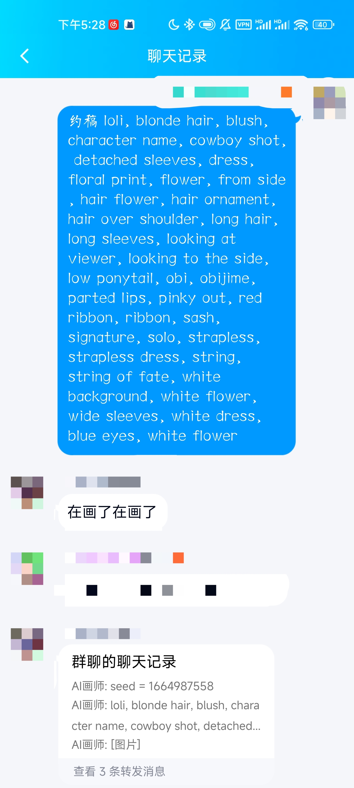
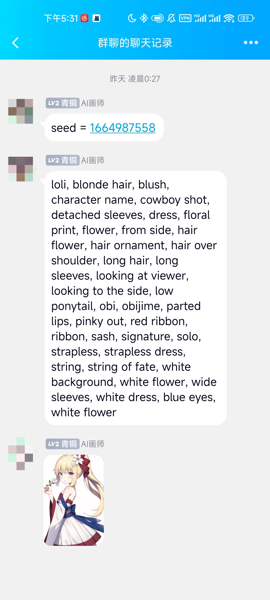

# koishi-plugin-novelai

[](https://www.npmjs.com/package/koishi-plugin-novelai)

基于 [NovelAI](https://novelai.net/) 的画图插件。已实现功能：

- [x] 绘制图片
- [x] 更改模型、采样器、图片尺寸
- [x] 高级请求语法
- [x] 自定义违禁词表
- [x] 发送一段时间后自动撤回
- [x] 连接到自建私服
- [x] img2img · 图片增强功能

得益于 Koishi 的插件化机制，只需配合其他插件即可实现更多功能：

- 多平台支持 (QQ、Discord、Telegram、开黑啦等)
- 速率限制 (限制每个用户每天可以调用的次数和每次调用的间隔)
- 上下文管理 (限制在哪些群聊中哪些用户可以访问)
- 多语言支持 (为使用不同语言的用户提供对应的回复)

**所以所以快去给 [Koishi](https://github.com/koishijs/koishi) 点个 star 吧！**

## 快速搭建

给没有使用过 Koishi 的新人提供一份简单的快速搭建指南：

> **Warning** \
> 在此之前，你需要一个**拥有有效付费计划的 NovelAI 账号**，本插件只使用 NovelAI 提供的接口。 \
> 付费计划请自行前往 [NovelAI](https://novelai.net/) 了解。

1. 前往[这里](https://github.com/koishijs/koishi-desktop/releases)下载 Koishi 桌面版
2. 启动桌面版，你将会看到一个控制台界面
3. 点击左侧的「插件市场」，搜索「novelai」并点击「安装」
4. 点击左侧的「插件配置」，选择「novelai」插件，填写你的[授权令牌](#token)，并点击右上角的「启用」按钮
5. 现在你已经可以在「沙盒」中使用画图功能了！

如果想进一步在 QQ 中使用，可继续进行下列操作：

1. 准备一个 QQ 号 (等级不要过低，否则可能被风控)
2. 点击左侧的「插件配置」，选择「onebot」插件，完成以下配置：
    - 在「selfId」填写你的 QQ 号
    - 在「password」填写你的密码
    - 在「protocol」选择 `ws-reverse`
    - 开启「gocqhttp.enable」选项
3. 点击右上角的「启用」按钮
4. 现在你可以在 QQ 上中使用画图功能了！

使用示例：

|  |  |
|:-:|:-:|

## 使用方法

### 绘制图片

输入「约稿」+ 关键词进行图片绘制。关键词需要为英文，多个关键词之间用逗号分隔。例如：

```
约稿 koishi
```

### 切换生成模型

可以用 `-m` 或 `--model` 切换生成模型，可选值包括：

- `safe`：较安全的图片
- `nai`：自由度较高的图片 (默认)
- `furry`：福瑞控特攻

```
约稿 -m furry koishi
```

### 更改图片方向

可以用 `-o` 或 `--orient` 更改图片方向，可选值包括：

- `portrait`：768×512 (默认)
- `square`：640×640
- `landscape`：512×768

```
约稿 -o landscape koishi
```

### 设置采样器

可以用 `-s` 或 `--sampler` 设置采样器，可选值包括：

- `k_euler_ancestral` (默认)
- `k_euler`
- `k_lms`
- `plms`
- `ddim`

一般推荐使用 `k_euler_ancestral`，具体有啥区别我也不知道 (欢迎在 issue 中讨论)。

### 调整影响因子

使用半角方括号 `[]` 包裹关键词以弱化该关键词的影响，使用半角花括号 `{}` 包裹关键词以强化该关键词的影响。例如：

```
约稿 [tears], {spread legs}
```

### 要素混合

使用 `|` 分隔多个关键词以混合多个要素。例如：

```
约稿 cat | frog
```

你将得到一只缝合怪 (字面意义上)。

## 配置项

### token

- 类型：`string`

授权令牌 (必填)。获取方式如下：

1. 在网页中登录你的 NovelAI 账号
2. 打开控制台 (F12)，并切换到控制台 (Console) 标签页
3. 输入下面的代码并按下回车运行

```js
console.log(JSON.parse(localStorage.session).auth_token)
```

4. 输出的字符串就是你的授权令牌

### model

- 类型：`'safe' | 'nai' | 'furry'`
- 默认值：`'nai'`

默认的生成模型。

### orient

- 类型：`'portrait' | 'square' | 'landscape'`
- 默认值：`'portrait'`

默认的图片方向。

### sampler

- 类型：`'k_euler_ancestral' | 'k_euler' | 'k_lms' | 'plms' | 'ddim'`
- 默认值：`'k_euler_ancestral'`

默认的采样器。

### anatomy

- 类型：`boolean`
- 默认值：`true`

默认情况下是否过滤不良构图。

### basePrompt

- 类型: `string`
- 默认值: `'masterpiece, best quality'`

所有请求的附加标签。默认值相当于开启网页版的「Add Quality Tags」功能。

### forbidden

- 类型：`string`
- 默认值：`''`

违禁词列表。含有违禁词的请求将被拒绝。

### endpoint

- 类型：`string`
- 默认值：`'https://api.novelai.net'`

API 服务器地址。如果你通过泄露的模型搭建了私服，可以将此项设置为你的服务器地址。

### requestTimeout

- 类型：`number`
- 默认值：`30000`

当请求超过这个时间时会中止并提示超时。

### recallTimeout

- 类型：`number`
- 默认值：`0`

图片发送后自动撤回的时间 (设置为 `0` 禁用此功能)。
